# Doctor Persona User Stories

| ID | User Story | Priority | Why This Matters (PM Lens) |
|---|---|---|---|
| D1 | As a doctor, I want to create a personalized diet chart in under 2 minutes so that I can see more patients without compromising quality. | Must-Have | Core value prop; directly addresses 20+ min pain point. |
| D2 | As a doctor, I want to quickly assess a patient’s Ayurvedic constitution (Prakriti) digitally so that I can tailor recommendations faster. | Must-Have | Forms the basis of personalization; cannot function without it. |
| D3 | As a doctor, I want a dashboard of all my patients with their compliance scores and progress so that I can quickly decide whose plan needs adjustment. | Must-Have | Enables data-driven care and better follow-ups. |
| D4 | As a doctor, I want to edit diet charts manually if needed so that I can apply my expertise on top of AI suggestions. | Should-Have | Gives trust & control to doctors; builds adoption confidence. |
| D5 | As a doctor, I want to schedule appointments and send follow-up reminders to patients so that I don’t miss reviews. | Should-Have | Improves continuity of care; strengthens engagement. |
| D6 | As a doctor, I want analytics on patient outcomes and compliance trends so that I can improve treatment protocols over time. | Could-Have | Useful for research/hospitals but not critical for MVP. |

## Diet Plan Generation Sequence Diagram

```mermaid
sequenceDiagram
    participant D as 🩺 Doctor
    participant S as 🤖 System
    participant KB as 📚 KB
    participant R as 🥘 RecipesDB
    participant DB as 🗄️ DB

    D->>S: Generate plan for patient_id
    S->>DB: Fetch patient profile & season
    S->>R: Query recipes matching constraints
    S->>KB: Query supporting guidelines for chosen items
    S-->>D: Display generated plan (reasons + nutrients)
    D->>S: Edit / Approve
    S->>DB: Save plan (doctor_verified)
    S->>D: Confirmation / publish to patient
```

