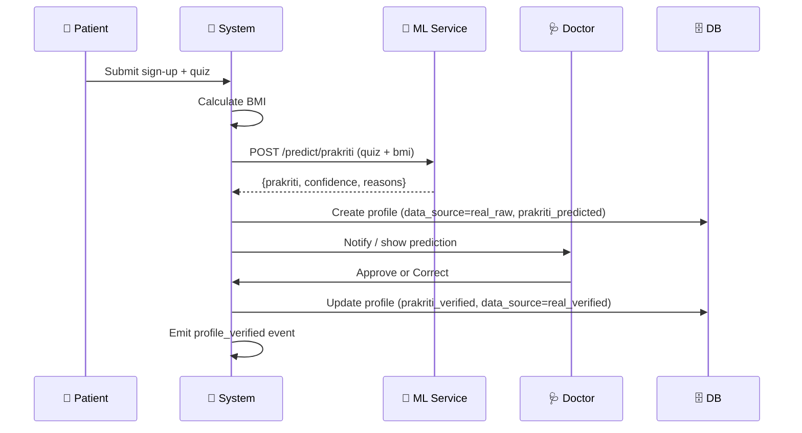

# Patient Persona User Stories

| ID | User Story | Priority | Why This Matters |
|---|---|---|---|
| P1 | As a patient, I want to receive my diet chart in my regional language so that I clearly understand what to eat. | Must-Have | Multilingual support is critical in India; improves adoption. |
| P2 | As a patient, I want to log my meals and symptoms easily so that I can share accurate data with my doctor. | Must-Have | Core engagement loop; feeds back into personalization engine. |
| P3 | As a patient, I want to reminders for meals and check-ins so that I can stay compliant with my plan. | Should-Have | Boosts adherence by 30–40%; increases NPS and outcomes. |
| P4 | As a patient, I want to get instant feedback if my logged meal is off-plan so that I can correct it in real-time. | Should-Have | Adds gamification; improves learning & habit formation. |
| P5 | As a patient, I want to share my progress with family members so that they can support me in following my diet. | Could-Have | Adds virality but can wait until after core flow is smooth. |

## Patient Onboarding Sequence Diagram

