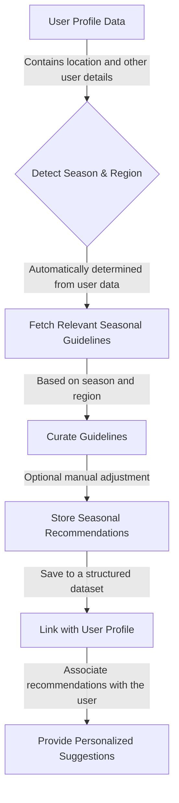

# Seasonal Guideline Recommendation Flow

This document outlines the flow for generating personalized seasonal guidelines for users.

```mermaid
flowchart TD
    A[User Profile Data] -- Contains location and other user details --> B{Detect Season & Region};
    B -- Automatically determined from user data --> C[Fetch Relevant Seasonal Guidelines];
    C -- Based on season and region --> D[Curate Guidelines];
    D -- Optional manual adjustment --> E[Store Seasonal Recommendations];
    E -- Save to a structured dataset --> F[Link with User Profile];
    F -- Associate recommendations with the user --> G[Provide Personalized Suggestions];
```
