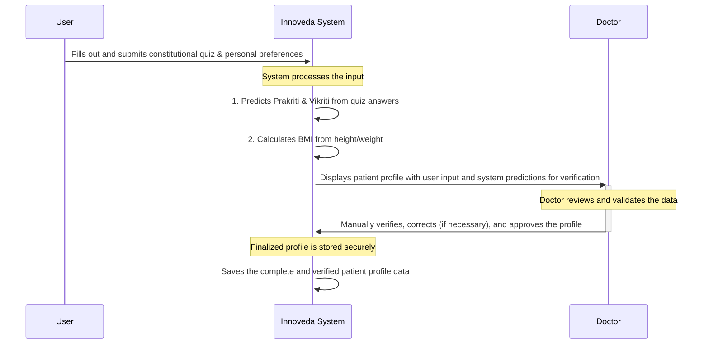

# User Profile Data Flow Diagram

This diagram illustrates the sequence of events for capturing, processing, and verifying user profile data within the Innoveda platform.

```mermaid
sequenceDiagram
    participant User
    participant Innoveda System
    participant Doctor

    User->>+Innoveda System: Fills out and submits constitutional quiz & personal preferences
    
    Note over Innoveda System: System processes the input
    Innoveda System->>Innoveda System: 1. Predicts Prakriti & Vikriti from quiz answers
    Innoveda System->>Innoveda System: 2. Calculates BMI from height/weight
    
    Innoveda System->>+Doctor: Displays patient profile with user input and system predictions for verification
    
    Note over Doctor: Doctor reviews and validates the data
    Doctor->>-Innoveda System: Manually verifies, corrects (if necessary), and approves the profile
    
    Note over Innoveda System: Finalized profile is stored securely
    Innoveda System->>Innoveda System: Saves the complete and verified patient profile data

```
