# User Profile Creation Flow (Patient's Perspective)

Based on the application's design, the user profile creation flow from the patient's (user's) side is simple and direct. The more complex steps like doctor verification and model retraining happen in the background without requiring the user's interaction.

From the patient's perspective, the flow is as follows:

1.  **Sign-Up & Quiz:** The user starts by filling out a registration form and a quiz with their personal details, such as age, gender, and lifestyle information.
2.  **Profile Creation:** Once the form is submitted, the system immediately processes this information, calculates metrics like BMI, predicts the user's Prakriti/Vikriti, and creates their profile.

Here is a simplified sequence diagram to illustrate the flow from the patient's viewpoint:

```mermaid
sequenceDiagram
    participant 👤 Patient
    participant 🤖 System

    👤 Patient->>🤖 System: 1. Fill out Sign-Up Form & Quiz
    activate 🤖 System
    🤖 System-->>👤 Patient: 2. Profile is created and insights are shown
    deactivate 🤖 System
```

